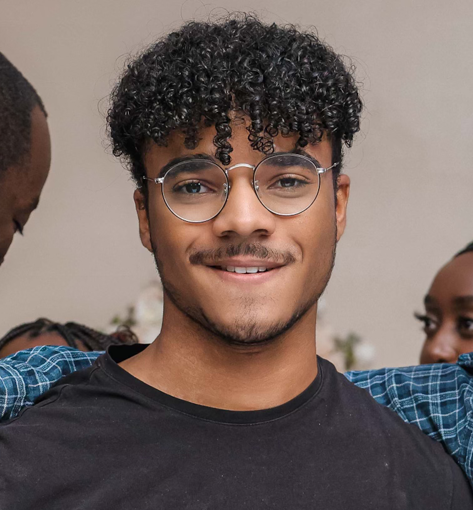

# About Me

Hello! Im Aaron, a full-time student a Georgia State University, majoring in computer science. This is still a work in progess and will probably take some time to fully flush out.

I'll still testing out MkDocs, want to try Hexo later.

##  Experiences
Lorem

##  Interests
Things
